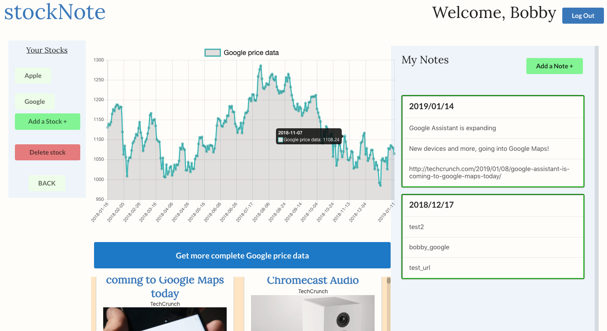

# stockNote Frontend (investments-research-platform)

## stockNote is an amateur stocks and shares research platform where a user can:

- create an authenticated user profile
- add stocks to their watchlist
- get news on their selected stocks
- see stock price data for the last year (US stocks only) + a link out to Google Finance for more complete data. 
- add notes / comments to their stocks so that a user can keep track of their thoughts and analysis
- send themselves the notes by email now or at ata future date of their choosing.

### Home page

### Profile page - main
 
On the left-hand side, you can add new stocks / delete existing ones in your portfolio.

### Stock specific page - adding a new note

### Stock specific page - chart

This project was bootstrapped with [Create React App](https://github.com/facebook/create-react-app).

The app is live at http://stock-note.surge.sh/ with the backend hosted on Heroku. Upon arrival, the server may take a few seconds to post news onto the homepage. At this point, one can create an account and add stocks.

NOTE: The deployment to production has a few bugs and I am working through these.

## Available Scripts

In the project directory, you can run:

### `npm start`

Runs the app in the development mode. 
Open [https://stock-note-server.herokuapp.com/](https://stock-note-server.herokuapp.com/) to view it in the browser.
